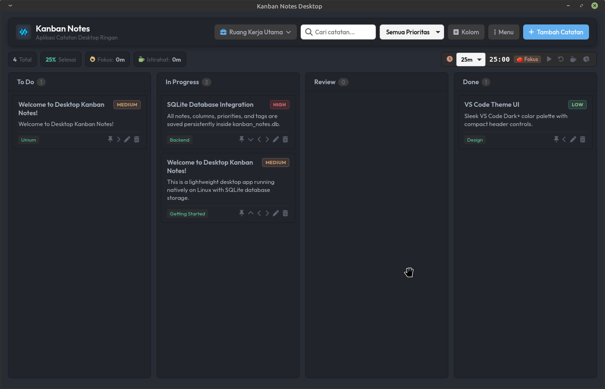
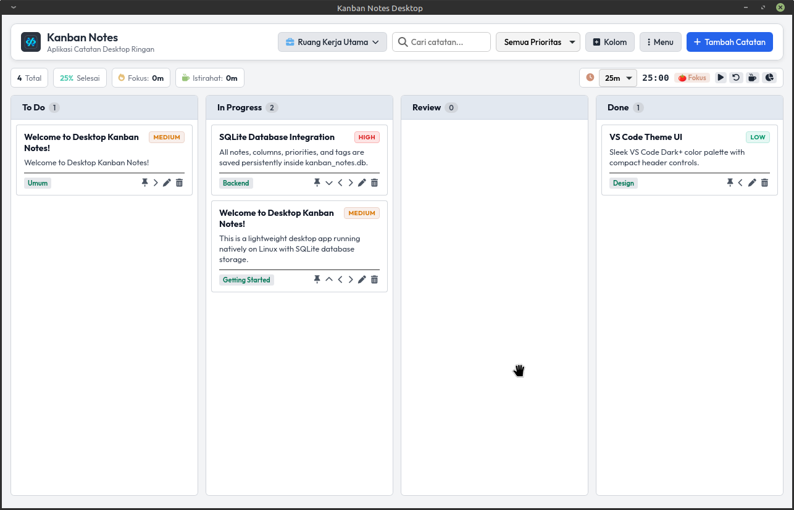

# 📋 Kanban Notes Desktop

> **Aplikasi Catatan Desktop Kanban Ringan, Responsif, dan Elegan dengan Dukungan Multi-Ruang Kerja & Timer Pomodoro.**

Kanban Notes Desktop adalah aplikasi produktivitas berbasis desktop yang menggabungkan kemudahan manajemen papan Kanban, sistem ruang kerja terpisah (*multi-workspace*), pelacak waktu produktif (*Pomodoro Timer*), dan penyimpanan data lokal persisten berbasis **SQLite**.

---

## 📸 Tampilan Layar (Screenshots)

### 🌙 Dark Mode (Tema Gelap)


### ☀️ Light Mode (Tema Terang)


---

## ✨ Fitur-Fitur Utama

- 💼 **Kelola Multi-Ruang Kerja (Multi-Workspace)**
  - Organisasikan catatan Anda berdasarkan proyek (misal: *Pribadi, Kantor, Proyek App*).
  - Papan modal kelola ruang kerja dilengkapi fitur **pencarian cepat (live search)** dan **paginasi berbasis ikon**.

- 🎯 **Papan Kanban Interaktif**
  - Kolom bawaan: **To Do**, **In Progress**, **Review**, dan **Done**.
  - **Tambah Kolom Kustom** sesuai kebutuhan alur kerja Anda.
  - Geser catatan antar kolom dengan tombol navigasi cepat atau fitur *drag & drop*.

- ⏱️ **Timer Pomodoro Terintegrasi**
  - Pelacak waktu fokus (25m, 45m, 60m) dan waktu istirahat (5m, 10m, 15m).
  - Dilengkapi statistik total durasi fokus & istirahat secara *real-time*.

- 🎨 **Sistem Tema Ganda (Dual Theme)**
  - Beralih antara **Tema Gelap (Dark Mode)** dan **Tema Terang (Light Mode)** secara instan.
  - Menggunakan UI/UX modern dengan warna aksen yang kontras dan nyaman di mata.

- 💎 **100% Custom Modal UI (Tanpa Popup Default Browser)**
  - Dialog konfirmasi hapus, input kolom kustom, dan notifikasi alert menggunakan desain modal kustom yang indah & menyatu dengan tema.

- 🔍 **Pencarian & Filter Presisi**
  - Cari catatan secara instan berdasarkan judul atau isi content.
  - Filter catatan berdasarkan tingkat prioritas (*Urgent, High, Medium, Low*).

- 📥 **Export ke File Markdown (.md)**
  - Ekspor seluruh catatan papan Kanban Anda ke format file `.md` siap pakai dengan satu klik.

- ⚡ **Otomatis Berjalan (Autostart)**
  - Opsi untuk menjalankan aplikasi secara otomatis saat komputer dinyalakan (booting).

- 🗄️ **Penyimpanan Lokal Persisten (SQLite)**
  - Seluruh data disimpan secara aman dan independen di basis data lokal `kanban_notes.db`.

---

## 🛠️ Teknologi yang Digunakan

- **Backend / Desktop Wrapper**: Python 3, PyGObject (GTK3 WebView), `http.server`
- **Database**: SQLite3
- **Frontend / GUI**: Vanilla HTML5, Custom CSS3 Design System, JavaScript (ES6+)
- **Icon Set**: Font Awesome 6 Pro / Free

---

## 🚀 Cara Menginstal Paket Installer (.deb)

Untuk pengguna sistem operasi berbasis Linux (Ubuntu, Debian, Linux Mint, Pop!_OS, dll):

1. **Unduh file installer `.deb` terbaru**:
   ```bash
   kanban-notes-desktop_1.0.0_amd64.deb
   ```

2. **Jalankan perintah instalasi di terminal**:
   ```bash
   sudo dpkg -i kanban-notes-desktop_1.0.0_amd64.deb
   sudo apt-get install -f  # (opsional, jika ada dependensi yang perlu diselesaikan)
   ```

3. Buka aplikasi dari menu aplikasi desktop Anda dengan mencari **"Kanban Notes Desktop"**.

---

## 💻 Menjalankan dari Source Code (Pengembang)

Jika Anda ingin menjalankan aplikasi secara langsung tanpa menginstal:

1. **Prasyarat**:
   - Python 3.8+
   - PyGObject / GTK3 WebView

2. **Jalankan Aplikasi**:
   ```bash
   python3 main.py
   ```

3. **Membuat Paket Installer `.deb` Baru**:
   ```bash
   ./build-deb.sh
   ```

---

## 📄 Lisensi & Kredit

Dikembangkan dengan fokus pada kenyamanan pengguna, kecepatan performa lokal, dan produktivitas harian.
